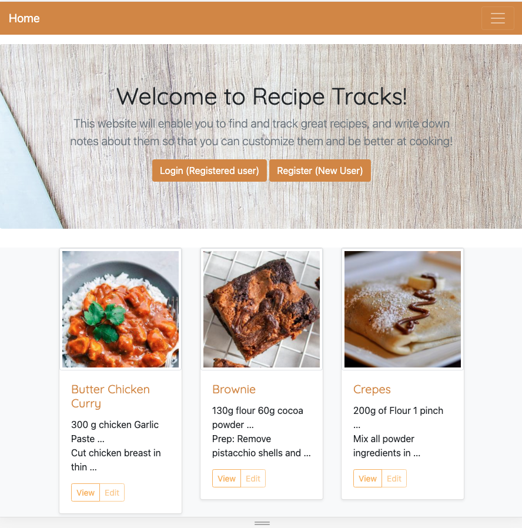

# RecipeTracks 🍰 🐟🐮

## Summary 🧑‍🏫
Website based on Django which allows users to store their own set of recipes, and to record their previous experimentations and notes.

More than a recipe database, this website app is made to keep track of the users experiments as a tool to actually improve one's cooking skills. Recipes should be flexible, according to one's taste and hardware (I am pretty sure that my oven cooks pound cakes in a different time than most of the other ones). Keeping track of all those experiments is the equivalent of handwritten notes on old recipe books!

## Seeing it live! 👍
The app is currently deployed at [Python Anywhere](http://afachin.pythonanywhere.com)

## Features 🛠️
* [User authentication](https://docs.djangoproject.com/en/3.2/topics/auth/) via Django
* Saving recipes in the database with `sqllite` DB
* Users are able to add a "track" to a recipe, which is a personal annotation to the recipe. (For example: I tried to bake the cake 45 minutes but it was too little, I want to try 55 minutes next time). [As an aside, this feedback loop is essential to mastering any skill, cooking being one of them]
* Multi-lingual website thanks to the [i18n](https://docs.djangoproject.com/en/3.2/topics/i18n/) django package

## Tech used 🛠️
* The website uses [Django]() as a framework, and obviously **Python** as a language
* Django templates are "beautified" using [Bootstrap](https://getbootstrap.com/)

